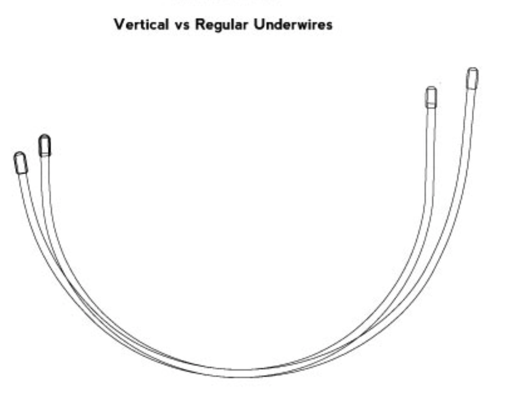
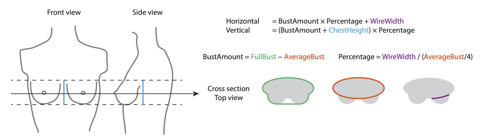

# Pattern drafting using computational geometry

This project automates and simplifies the pattern drafting method in in the book [Construction and Pattern Design for Lingerie](https://www.amazon.com/Bare-Essentials-Construction-Pattern-Lingerie/dp/1074526236).

## Motivation
A bra is a feat of complicated breast support engineering. Women's chest and breasts come in all shapes and sizes, but manufactured bras only have two parameters: cup size and band size. Cup size calculation requires full bust circumference, which is defined as the circumference of the fullest part of the breast when wearing a well-fitted bra. This creates a paradox: the search for a well-fitted bra requires an existing well-fitted bra. 

The second problem is that variations in the torso shape, v-shaped/straight, and tall/short, are not taken into consideration. For example, short individuals generally need a shorter wire but not a smaller cup. Instead of regular wires that point out to the sides, vertical wires that point straight up at each end should be used.

As a result, it is challenging to find a well-fitted, ready-to-wear bra. Personal custom bras exist but very few people can afford them. I am among the ones who attempted to sew their own bras. However, altering commercially available patterns has a steep learning curve. 

An alternative approach is to draft multiple patterns from scratch and find the best fit. Existing pattern drafting methods take hours to draft a pattern for one set of body measurements. The entire drafting process needs to be repeated again when one of the body measurements changes. *I don't like repetitive work.* So I wrote an algorithm to generate printable pdf patterns automatically. 

To my knowledge, nobody has combined **traditional pattern drafting methods** with **computational geometry** to generate custom sewing patterns. Similar approaches can be adopted to draft patterns for other types of garments including tailored suit and dresses.

## What is a sewing pattern?

### Finished bra

### Frame sewing pattern

### Cup sewing pattern

## Preparations before pattern drafting
### the underwire shape

The underwire is the most important component of a wired bra. There are multiple wire shapes to suit different body types. They can be tall and narrow, short and shallow, high on the sides, high at the front.  

The shape of the wire is often available at the supplier as pdf document. I traced the wire with bezier curves in Adobe Illustrator and converted coordiates of points on the wire to a CSV table. 

**↓ check out the code to extract the coordinates of the wire**

 

### body measurements

* underbust circumference: measure without wearing a bra
* fullbust circumference: start with a guess and try a range of values around the guess
* overbust circumference: measure without wearing a bra
* bust height: vertical distance between underbust and overbust
* distance between the two breasts: start with a guess and try a range of values around the guess

## Overview of pattern drafting using computational geometry in Python

The emperical pattern drafting method in the book is a sequence of geometric manipulations. The cup pieces are based on an ellipse, whose horizontal and vertical dimensions are calculated from body measurements. The bottom part of wire is approximately a circle, whose quarter circumference defines the length of ellipse corresponding to a quarter of the finished cup. The top two ellipse quarters are often combined to construct a 3 piece cup.

Each pattern piece is represented by a polygon with N vertexes and N+1 edges. Each edge is defined by a linear or quadratic Bézier curve, created with [bezier package](https://bezier.readthedocs.io/en/stable/index.html). Most geometric computations are done using [shapely package](https://shapely.readthedocs.io/en/stable/manual.html).

**↓ check out the code to create pattern for this partial band bra**

## Future features
### Create web based GUI

The user interface will include

* table for user to enter body measurements and other stylistic preference
* download button for each set of parameter

The goal is to make this tool accessible to people without codeing skill.

### Pattern with power bar

* Cup
	* Upper Cup and Lower Cup: The high point of the cup is referred to as the apex or bust point
	* Powerbar: Provide support for large breasts

* Frame
	* Front Side Band: no stretch fabric
	* Back Band: Stretch percentage is estimated by stretching a fabric along a 4” - 8” ruler scale. Begin with folded fabric at ease on a 4 inch measurement, and stretch the fabric towards 8 inch. If it comfortably reaches `X` inch, the stretch percentage is `(X-4)/4`, meaning the fabric has 50% stretch. 
	* Boning at the seam: Provide support for strapless bra design
	* Bridge: stabilized fabric to prevent stretching

### Alternative cup drafting methods

The problem of the empircal method is that I have trouble understanding how the formula for the horizontal and vertical measurements are derived. 

An alternative method is to model the finished cup as a 3D surface and then flatten the surface. However, the spherical surface has [positive gaussian curvature](https://en.wikipedia.org/wiki/Gaussian_curvature), and can not be flattened in mathematic terms. Woven fabric, in contrast, can cover certain surfaces with non-zero gaussian curvature due to extension, shear, and bending of the threads that make up the fabric. 

Another method that I'm excited about is [multiaxis three-dimensional weaving](https://journals.sagepub.com/doi/full/10.1177/0040517511435013). This method involves minimal sewing and is customizable. 

My vision for the future is to model the breast tissue as [gel](https://en.wikipedia.org/wiki/Gel) and the fabric as a network of rod elements. The goal is to design bras that provide the enough support for the breast tissue with minimal compression.

## Contributing

This project is open to contributions. 