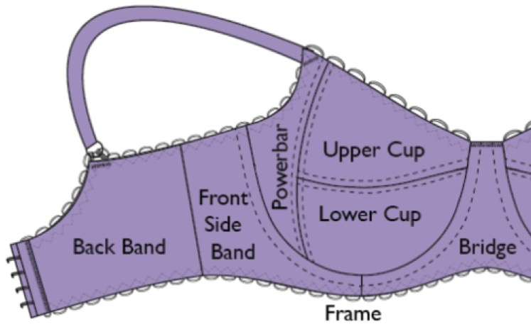
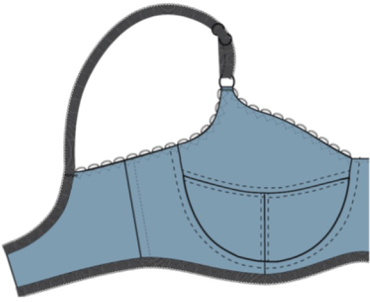
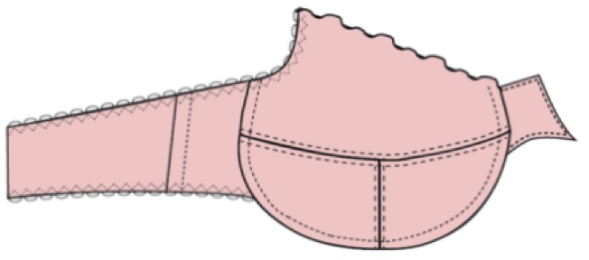
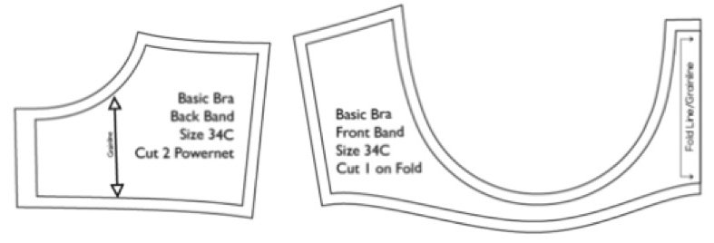

# parameterized-pattern-drafting

This project automates and simplifies the pattern drafting method in in the book [Construction and Pattern Design for Lingerie](https://www.amazon.com/Bare-Essentials-Construction-Pattern-Lingerie/dp/1074526236).

## Motivation
A bra is a complicated feat of breast support engineering. Women's chest and breasts come in all shapes and sizes but manufactured bras only have two parameters: cup size and band size. Cup size calculation requires full bust circumference, which is defined as the circumference of the fullest part of the breast when wearing a well-fitted bra. This creates a paradox: the search for a well-fitted bras requires an existing well-fitted bra. 

The second problem is that variations in the torso shape, v-shaped/straight and tall/short, are not taken into consideration. For example, short individuals generally need a shorter wire but not a smaller cup. So, instead of regular wires that point out to the sides, vertical wires that point straight up at each end should be used.

As a result, it is challenging to find a well-fitted, ready-to-wear bra. Personal custom bras exist but very few people can afford it. I am among the ones who attempted to sew their own bras. However, altering commercially available patterns has a steep learning curve. 

An alternative approach is to draft multiple patterns from scratch and identify the pattern with the best fit. Existing pattern drafting methods take hours to draft a pattern for one set of parameters. The entire drafting process needs to be repeated again when the parameters change. *I don't like repetitive work.* So I wrote an algorithm to generate printable pdf patterns automatically. To my knowledge, nobody has combined **traditional pattern drafting methods** with **computational geometry** to generate custom sewing patterns.

## Anatomy of a wired seamed bra

* Cup
	* Upper Cup and Lower Cup
		* The high point of the cup is referred to as the apex or bust point
		* One seam must intersect the apex
		* The position and direction of seams have many variations
	* Powerbar
		* Provide support for large breasts

* Frame
	* Front Side Band
		* no stretch fabric
	* Back Band
		* 50% stretch fabric
			* Stretch percentage is estimated by stretching a fabric along a 4” - 8” ruler scale. 
			* Begin with folded fabric at ease on a 4 inch measurement, and stretch the fabric towards 8 inch. If it comfortably reaches `X` inch, the stretch percentage is `(X-4)/4`. 
	* Boning at the seam
		* Provide support for strapless bra design
	* Bridge
		* stabilized fabric to prevent stretching

## Anatomy variations

### 3 piece cup

### frameless bra (partial band)

			
## Sewing patterns of the teal bra

### Frame

### Cup

## Problem statement

Given bust measurements, determine the relative coordinates of the lines in the sewing patterns

## Input parameters

* underbust circumference
	* measure without wearing a bra
* fullbust circumference
	* start with a guess and try a range of values around the guess
* overbust circumference
	* measure without wearing a bra
* bust height
	* vertical distance between underbust and overbust
* distance between the center of left and the center of right bust
* shape of the wire
	* wire manufactures use different curvature

## Python data structure

Each pattern piece is represented by a polygon with N vertexes and N+1 edges. Each edge is defined by a linear or quadratic Bézier curve, with the exception of the seam that connects the front band with the lower cups. This seam is where the wire is inserted, so its curvature is determined by the wire's curvature.

* Coordinates of vertexes: numpy array of shape `(2,)`
* The wire seam edge: numpy array of shape `(N,2,)`
* Bézier curve edges: numpy array of shape `(2,2,)` or `(3,2,)`
* A pattern piece: list of edges in clockwise order

## View example algorithm in Google Colab

## Future features